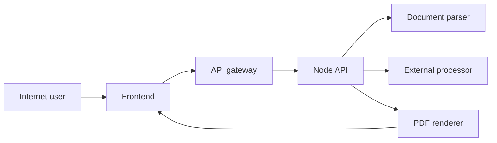

# 简历网站威胁模型

> 历史状态说明：本文保存的是 2026-09-24 安全改造前的威胁模型快照。此后仓库已加入邀请码会话、请求限流、并发队列、费用止损、解析子进程、安全响应头与隐私告知。本文中的匿名接口、缺少隔离和阿里云规划等描述仅代表当日状态；正式上线前需要针对最新代码与最终部署配置重新建立威胁模型。

审查日期：2026-09-24  
分支：`main`  
状态：代码预审；阿里云运行时配置和依赖在线复扫尚未验证。部署方案、邀请码、DAU 与预算为用户提供的规划信息，不代表已有实现。

## Executive summary

这是一个处理简历 PDF/DOCX、调用外部生成端点并导出 PDF 的无账号 Web 应用。最高风险是公网 API 缺少成本闸门和解析资源边界；静态前端与真实 API 的生产承载尚未闭环。`pdfjs-dist` 锁定版本命中高危公告，但公告利用条件与本项目浏览器预览路径的对应关系尚未验证，不应据此声称本项目已确认可执行任意代码。当前不应开放公网版本。

## Scope and assumptions

- **范围：** `src/`、`server/`、`worker/`、`package.json`、`package-lock.json`。
- **部署规划（待确认/验收）：** 计划部署阿里云并使用 HTTPS。具体是 ECS/容器、函数计算还是其他方案，网关与 API 拓扑、资源限制、WAF、RAM 和密钥注入尚无证据。
- **业务规划（待实现/校准）：** 首版拟经邀请码进入，目标日活 1,000–2,000，外部处理预算 100 元/日；当前仓库没有邀请码校验。无账号体系和用户数据持久化是本次代码检查结果，不代表云平台或日志无持久化。
- **成本样本（历史输入）：** 91 次请求、589,550 tokens、0.88 元的统计由用户提供，本次未从账单独立复算；样本均值不构成请求成本上限。
- **数据敏感性：** 高。简历可含姓名、联系方式、教育和工作经历。
- **外部处理：** 服务端将事实和编辑请求发往代码固定的外部端点；密钥不进入浏览器。
- **待确认：** API 将使用 ECS/容器还是函数计算；邀请码是否需要绑定用户身份或仅为共享码。

## System model

### Primary components

- React/Vite 前端：收集文件与事实，调用同源 `/api/*`，显示 PDF 预览（`src/api.js:21-67`、`src/ResumePreview.jsx:6-120`）。
- Express API：接收文件、诊断/生成 JSON 和导出请求（`server/app.js:37-154`）。
- 文档解析：PDF.js、Mammoth、头像提取（`server/extract-document.js:94-145`、`server/extract-avatar.js:77-88`）。
- 外部处理适配层：固定端点、密钥在服务端请求头中使用（`server/providers/openai.js:5-25`、`server/providers/compatible-chat.js:5-24`）。
- PDF 渲染：React PDF 在内存中生成结果（`server/render/render-pdf.js:7-12`）。
- 静态 Worker：仅负责资源和 SPA 回退，不能承接 API（`worker/index.js:1-16`）。

### Data flows and trust boundaries

- Internet → Frontend：简历文件、事实、头像；HTTPS 由未来阿里云网关负责，仓库中无该配置。
- Frontend → API：multipart 上传及最高 4 MB JSON；文件有 10 MB 限制和基础魔数检查（`server/app.js:39,64-70`、`server/document-validation.js:3-38`）。当前无认证、邀请码校验或速率限制。
- API → Document parser：不可信 PDF/DOCX 在内存中解析；PDF 页数限制在打开文件后才检查（`server/extract-document.js:94-122`）。解析 CPU、内存和墙钟时间未见独立隔离。
- API → External processing endpoint：简历事实、目标岗位和追问；HTTPS、固定端点、服务端 Authorization 头、请求超时（`server/providers/request-json.js:4-28`）。
- API → PDF renderer → Frontend：编辑后的内容和可选本地头像进入内存 PDF，再作为 attachment 返回（`server/app.js:126-133`、`server/export-input.js:40-58`）。

#### Diagram

## Assets and security objectives

| Asset | Why it matters | Security objective |
| --- | --- | --- |
| Resume files and facts | Contains personal and employment data | C, I |
| External provider keys | Can create direct financial loss and permit unauthorized processing | C, I |
| Processing budget and Node capacity | Required for users to complete submissions | A |
| Rendered PDF | Must preserve user-approved content and not leak another request's data | C, I |
| Invite-code state | Must prevent uncontrolled access and quota bypass | I, A |
| Build artifacts and deployment config | Must not expose development tooling or secrets | C, I, A |

## Attacker model

### Capabilities

- Remote unauthenticated attacker can submit crafted PDF/DOCX and JSON to publicly reachable API routes.
- Attacker can automate requests, share an invite code if one is not bound or rate-limited, and induce retries with malformed or difficult inputs.
- Attacker can inspect browser-delivered JavaScript and public HTTP responses.

### Non-capabilities

- No evidence that an attacker can supply arbitrary outbound URLs: external endpoints are fixed in source.
- No evidence of database, server-side user account, cookie session or cross-tenant storage in this repository.
- No evidence that provider keys are delivered to the browser or tracked by Git.

## Entry points and attack surfaces

| Surface | How reached | Trust boundary | Notes | Evidence |
| --- | --- | --- | --- | --- |
| `POST /api/extract` | Multipart upload | Internet → parser | 10 MB memory upload; PDF/DOCX parsing | `server/app.js:39,64-70` |
| `POST /api/diagnose` | JSON | Internet → external endpoint | Can trigger external request and retries | `server/app.js:73-84` |
| `POST /api/optimize` | JSON | Internet → external endpoint | Can trigger external request and fallback generation | `server/app.js:87-123` |
| `POST /api/export` | JSON | Internet → renderer | Can consume rendering CPU/memory | `server/app.js:126-137` |
| PDF preview | Generated Blob in browser | browser → PDF.js | Uses the same direct dependency family | `src/ResumePreview.jsx:3,107-118` |
| Static Worker | HTTP request | Internet → asset storage | Does not implement API routing | `worker/index.js:1-16` |

## Top abuse paths

1. Attacker reaches anonymous `/api/optimize` → repeats requests or shares one invite code → API invokes up to three external calls per task → budget is exhausted and valid users lose access.
2. Attacker uploads many 10 MB or compressed-bomb documents → Multer buffers each request and parser expands content → Node process memory/CPU is exhausted → API outage.
3. Attacker uploads a malformed PDF → server PDF.js parses it; browser PDF.js is also a direct dependency but current preview loads app-generated PDFs → resource exhaustion remains a plausible parser risk; the cited arbitrary-JavaScript advisory requires scripting-enabled PDF.js viewer behavior and missing CSP, and that precise path has not been confirmed here.
4. Operator publishes only the static Worker → browser calls `/api/*` with no API handler → core product failures → operator may expose Vite dev server as a workaround → development-server attack surface becomes public.
5. Attacker obtains a shared invite code → runs automated document/export requests within a code-only gate → per-user intent is indistinguishable → resource abuse evades an invite-only policy.
6. User submits a resume without accurate notice → facts cross to an external processor → user complaint or data-governance failure → product trust and compliance impact.

## Threat model table

| Threat ID | Threat source | Prerequisites | Threat action | Impact | Impacted assets | Existing controls (evidence) | Gaps | Recommended mitigations | Detection ideas | Likelihood | Impact severity | Priority |
| --- | --- | --- | --- | --- | --- | --- | --- | --- | --- | --- | --- | --- |
| TM-001 | Remote bot | Public route or leaked/shared invite | Repeatedly calls diagnosis and generation | Budget exhaustion and API unavailability | Keys, budget, availability | Per-request timeout and max three attempts (`server/providers/index.js:11-87`) | No auth, invite enforcement, rate, quota or concurrency control | Hash invite codes; quota by code/IP; global queue; daily monetary circuit breaker | Per-route count, latency, retry rate, spend alarm | High | High | high |
| TM-002 | Remote uploader | Public extract route | Sends decompression bomb, huge image or malformed document | Node process memory/CPU exhaustion | Availability, user data in memory | File size, page, source-block limits (`server/document-validation.js:3-38`, `server/extract-document.js:96-115`) | Memory storage, no parsing sandbox, image pixel cap, CPU timeout or queue | Worker/container isolation; CPU/memory timeout; decompression and pixel limits | RSS, event-loop lag, parser timeout, rejected-file metrics | High | High | high |
| TM-003 | Remote uploader or browser user | A PDF.js code path matching GHSA preconditions is reachable | Opens a malicious PDF with scripting enabled and without a CSP that blocks scripts | Advisory describes attacker-controlled JavaScript in hosting origin; project reachability is unconfirmed | Browser origin data and integrity | App uses PDF.js to parse uploads server-side and render app-generated preview PDFs | Locked `5.7.284` falls in `>=5.6.83 <6.2.108`; no project exploit reproduction; raw uploaded PDF is not confirmed to open in browser preview | Upgrade to `6.2.108+`; disable scripting where applicable; set CSP; trace data flow and validate actual viewer path | CI dependency scan; confirm upload-to-preview flow and PDF.js options; browser security regression | Medium (provisional) | High if preconditions match | high until upgraded and triaged |
| TM-004 | Remote caller | API is reachable | Uses code sharing or source-IP rotation to bypass invite-only intent | Budget loss and noisy availability failures | Invite state, budget | No current invite implementation | Invite code alone has no identity or multi-dimensional quota | Code expiry/revocation; code/IP limits; optional login/phone binding for high quota | Invite redemption anomalies, distinct IPs per code | High | Medium | high |
| TM-005 | Clickjacking or browser attacker | Production headers absent at edge | Frames site or exploits weak browser defaults | User action manipulation or increased browser exposure | User data, integrity | Same-origin API is implicit; no cookie session | No visible security headers, 404 or X-Powered-By disable | Header baseline at Node/gateway; strict CSP/frame ancestors; no permissive CORS | Header regression check from public URL | Medium | Medium | medium |
| TM-006 | Deployment operator error | Static and API deployment split | Publishes static frontend alone or exposes dev server | Product outage or dev-server exposure | Availability, build artifacts | Worker only serves assets (`worker/index.js:1-16`) | No production API deployment definition | Deploy API separately behind HTTPS gateway; never run Vite dev server publicly | Synthetic `/api` health checks after deploy | Medium | High | high |
| TM-007 | Privacy complainant or compromised external processor | User submits resume | Third party receives personal resume data without adequate notice | Trust/compliance risk | User data, reputation | Keys stay server side; no local persistence found | No visible consent, retention or deletion policy | Just-in-time consent and privacy policy; data minimization; secret manager | Consent receipt counts, privacy-request log | Medium | Medium | medium |

## Criticality calibration

- **Critical:** Remote code execution in the API process; confirmed provider-key exfiltration; cross-user resume disclosure. None is confirmed in this review.
- **High:** Anonymous spend exhaustion, document-parser DoS, directly reachable high-risk dependency, or API deployment that forces a dev-server workaround. TM-001 through TM-004 and TM-006 meet this threshold.
- **Medium:** Browser hardening gaps and personal-data governance gaps where exploitation or legal impact depends on final edge configuration. TM-005 and TM-007 fall here.
- **Low:** Framework fingerprinting and low-value metadata exposure such as the publicly returned methodology version.

## Focus paths for security review

| Path | Why it matters | Related Threat IDs |
| --- | --- | --- |
| `server/app.js` | All externally reachable API routes and middleware order | TM-001, TM-002, TM-005 |
| `server/document-validation.js` | File type and size validation boundary | TM-002 |
| `server/extract-document.js` | PDF/DOCX parser invocation and page handling | TM-002, TM-003 |
| `server/extract-avatar.js` | Image decoding and pixel-memory use | TM-002 |
| `server/providers/` | Key use, retries, outbound endpoint boundary | TM-001, TM-007 |
| `src/api.js` | Public API client and same-origin assumptions | TM-001, TM-006 |
| `worker/index.js` | Static deployment behavior | TM-006 |
| `package.json` and `package-lock.json` | Vulnerable direct and build dependencies | TM-003 |
| Future Alibaba Cloud IaC or deployment config | TLS, ingress, secrets, security groups, logs and rate controls | TM-001, TM-005, TM-006, TM-007 |

## Quality check

- Covered discovered runtime endpoints, file parsing, rendering, outbound calls and static worker behavior.
- Covered each trust boundary in at least one threat.
- Separated runtime findings from build-only Vite and related dependency findings.
- Incorporated user-provided deployment, invitation and volume planning context, clearly marked as not implemented/configuration-verified.
- Remaining material assumptions: exact Alibaba Cloud runtime service, whether codes are unique or shared, reliable near-real-time cost attribution, and whether the PDF.js advisory's scripting-enabled viewer conditions are reachable.
- The npm audit history was not revalidated because this environment could not reach the npm advisory endpoint; run current production and full dependency scans in connected CI before release.
